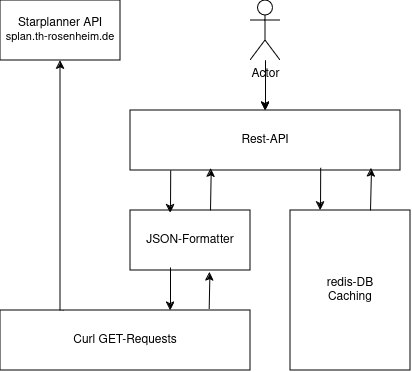
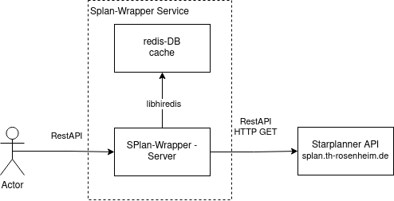
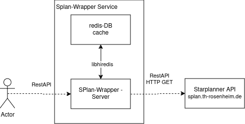
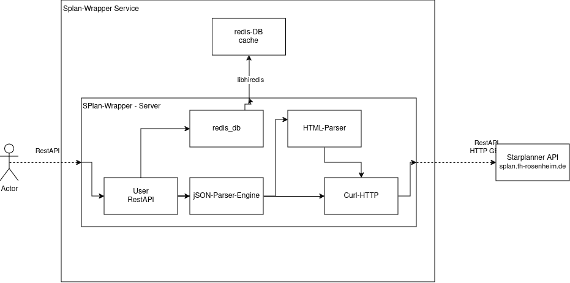
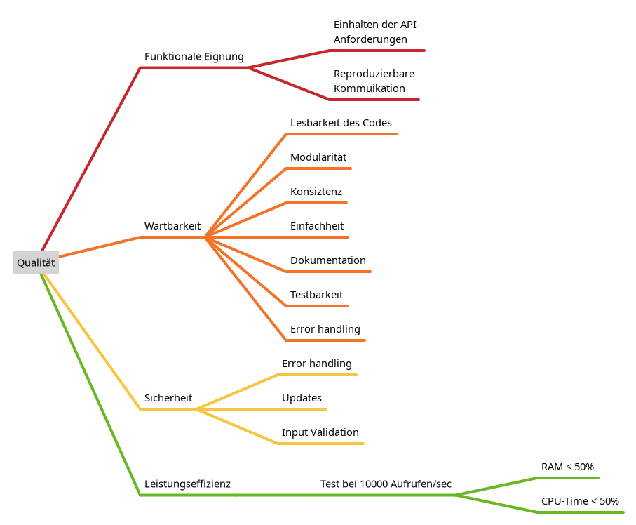

#  StarPlan API Wrapper

# Einführung und Ziele

## Aufgabenstellung
Da die StarPlanner-API nicht für Automatisierung entworfen wurde, werden Daten
unter anderem als HTML über JSON-Endpunkte übertragen. Um Nutzern
automatisierte Abfragen des Stundenplans zu erlauben, wird eine Wrapper API
benötigt, welche die StarPlanner Daten konvertiert.

Da die StarPlanner-Webseite nicht für Automatisierung ausgelegt ist, muss davon
ausgegangen werden, dass das StarPlanner backend nicht mit erhöhter Last umgehen
kann.

Die Grundlegenden Anforderungen an die Software bestehen aus einer Rest-API für
die Nutzer, Robustheit für HTTP-GET-Requests und -Daten. Damit StarPlanner nicht
überlastet wird muss ebenso eine Caching-Datenbank benutzt werden.

Um einen möglichst geringen Ressourcen verbrauch zu gewährleisten, wird die
Wrapper Software in C-99 geschrieben. Diese Entscheidung hat starke Einwirkungen
auf die Architektur sowie Qualitätsziele.

## Architektur

Da C keine Klassen hat, und somit die meisten Tools nicht funktionieren, ist es
wichtig manuell während des Reviews die Software-Architektur zu überprüfen.

Als Richtlinie wird hier dennoch eine Art Schichten Architektur benutzt. Die
Schichten bestehen aus der Rest-API für den Benutzer; einem JSON-Formatter Layer
sowie curl für die HTTP-GET-Requests. Parallel zu den drei Letzen Layern gibt
es einen Layer für die redis Caching Datenbank die direkt mit der Rest-API
kommuniziert.

## Qualitätsziele

Die wichtigsten Qualitätsanforderungen für die Wrapper Software sind die
"Funktionale Eignung", "Sicherheit" und "Leistungseffizienz".

| Ziele               | Szenario       |
|---------------------|----------------|
| Funktionale Eignung |  Da dies eine Automatisierungs-Schnittstelle sein soll, ist es nötig, dass das Verhalten der API dasselbe ist, wie dokumentiert / Vorgegeben ist |
| Wartbarkeit         |  Da dieses Projekt langlebig sein muss und mit API-Änderungen zurechtkommen muss ist gute build-Automatisierung und Dokumentation wichtig |
| Sicherheit          | Da dieses Projekt langlebig sein muss und mit API-Änderungen zurechtkommen muss ist gute build-Automatisierung und Dokumentation wichtig |
| Leistungseffizienz  | Da dieser Server auf kleinsten Geräten laufen soll z.B. Raspberry Pi 1/2, dürfen nicht zufiele Ressourcen verwendet werden |

## Stakeholder

| Rolle        | Kontakt        | Erwartungshaltung |
|--------------|----------------|-------------------|
| Endnutzer    | -              | Verfügbarkeit, Uptime sowie Einfachheit in der Benutzung. Ebenso Guten Support und Dokumentation. Gute Sicherheitsabdeckung |
| Dozenten     | -  | -  |
| Entwickler   | Lars.niesen@stud.th-rosenheim.de |  Gute Wartbarkeit & Automatisierung Konsistenz in der API-Anbindung |
| API-Anbieter | - | Geringe Datennutzung. Kein missbrauch der bereitgestellten API |

# Randbedingungen

| Randbedingung      | Erläuterung    |
|--------------------|----------------|
| StarPlanner-API    | Da die Hauptschnittstelle zum externen Service von StarPlanner bereitgestellt wird und nicht dokumentiert ist, muss diese reverse Engineered werden. Hierbei ist zu beachten, die Schnittstelle so einfach wie möglich abzubilden |
| Niedrige Ressourcen | Da die Software auf kleinen Geräten laufen soll, ist der Ressourcenverbrauch zu kontrollieren und einzuhalten|
| cross-platform      | Um möglichst einfach viel Hardware-Kompatibilität zu haben, ist cross-platform Entwicklung nötig. dies Bezieht sich auf OS-Spezifische Libraries sowie System header|
| Hosten auf Github   | Das gesamte Repository muss auf GitHub gehostet werden und mit GitHub-Actions funktionieren |

# Kontextabgrenzung

## Fachlicher Kontext

Die Grenzen des Systems (Gestrichelte Box in der Grafik) bestehen aus der
Rest-API für den Endnutzer (Actor) sowie der Rest-API/HTTP-2.0 GET API nach StarPlanner.

### Benutzer Rest-API Schnittstelle

| Endpunkt      | Berschreibung  |
|--------------------|-----------|
| /semesters    | Liste aller Semester (benutzt im GET-Request für /lectures) |
| /faculties    | Liste aller Fakultäten (benutzt im GET-Request für /lectures) |
| /lectures     | Liste aller Module die durch Semester und Fakultät ausgewählt worden sind |

Um die Nutzerschnittstelle für Automatisierung zu benutzen ist es wichtig eine
saubere Trennung von den einzelnen Endpunkten anzubieten. Diese Trennung
erfolgt thematisch. D.h. die einzelnen Datenstrukturen bekommen eigene Endpunkte.
Die Konfiguration wird als Teil einer Anfrage (GET-Request) als Parameter übertragen.
Alle Schnittstellen sind read-only Anfragen.

### StarPlanner API Schnittstelle (reverse Engineered)

API-Endpunkt: https://splan.th-rosenheim.de/splan/

| Endpunkt      | Berschreibung  |
|--------------------|-----------|
| /json    | Parametrisierte API-Schnittstelle |

Die Schnittstelle, die von Starplanner bereitgestellt wird, musste für dieses
Projekt reverse Engineered werden. Alle API-Anfragen gehen über den /JSON
Endpunkt. Über Parametrisierung mit dem `m=` Parameter wird intern das
verhalten des Endpunkts geändert. Dies führt zu einer komplexen API
Parametrisierung.

## Technischer Kontext

### Benuzter RestAPI Schnittstelle

| Endpunkt      | Berschreibung  |
|--------------------|-----------|
| /semesters    | Liste aller Semester (benutzt im GET-Request für /lectures) |
| /faculties    | Liste aller Fakultäten (benutzt im GET-Request für /lectures) |
| /lectures     | Liste aller Module die durch Semester und Fakultät ausgewählt worden sind |

Alle von dem Wrapper bereitgestellte API-Endpunkte sind Rest-API GET
Schnittstellen die JSON-Objekte zurückliefern. Als Standard wird HTTP-2.0
benutzt und keine TLS-Verschlüsselung. Um Andere Protokolle zu benutzen muss
ein Reverse-Proxy vor den Wrapper geschaltet werden. Dies erlaubt eine
Einfachere Entwicklung für den eigentlichen Wrapper und ist in den meisten Fällen ausreichend.
Parametrisierung findet durch JSON-Objekte im Body des GET-Requests statt. Dies
geht gegen die Empfehlung des
[RFC-2616 sect. 4](https://www.rfc-editor.org/rfc/rfc2616#section-4.3) ist aber
für die potenzielle Menge an Filterbaren Module nötig.

### StarPlanner API Schnittstelle (reverse engineered)

API Endpunkt: https://splan.th-rosenheim.de/splan/

| Endpunkt      | Berschreibung  |
|--------------------|-----------|
| /json?m=getTT...    | Stundenplan mit parametern |
| /json?m=getlocs...    | Liste für Universitäten |
| /json?m=getpus...    | Liste von Semestern |
| /json?m=getogs...    | Liste von Fakultäten |
| /json?m=getPgsExt...    | List von Module pro Fakultät und Semestern |

Dieser Endpunkt stellt mehrere, durch Parameter einstellbare, verhalten bereit.
Jeder dieser Parameter ist mit speziell entwickelten
Kompressions-/Encodierungs-Algorithmen versehen, um die Request-URL kurz zu halten.
Diese Algorithmen müssen von der Wrapper Seite implementiert werden um aus
Menschen Lesbare JSON die Encodierte Variante für StarPlanner zu machen.

Für genaue Beschreibung der Parameter siehe [splan-api](./splan-api).

# Lösungsstrategie

## Benutzte Technologien in der Software

### Programmiersprache: C
Um die Ressourcen minimal zu halten, wird eine Low-Level Programmiersprache
benutzt. Zur Auswahl standen C und C++. Da die Entwickler mehr Erfahrung in C
hatten und durch die gewählten Libraries mit C-Datentypen in C++ arbeiten müssen wurde C gewählt.

### Buildsystem: CMake

Um das C-Project Automatisiert und reproduzierbar zu bauen, wird CMake benutzt.
Cmake erlaubt außerdem sehr einfache Integration von Unittests.

### API-Libraries

Um sicher und Stabile Schnittstellen zu haben. wird für die Requests nach
splan.th-rosenheim.de `curl` eingesetzt welche aktiv in Entwicklung ist und auf
fast jedem System bereits installiert ist. Für die Rest-API Schnittstelle wird
`microhttpd` verwendet. Diese ist ebenfalls in aktiver Entwicklung und ist weit verbreitet.
Aus denselben Gründen wird `cJSON` für das Parsen und Generieren von JSON
Objekten benutzt, und `hiredis` für die Verbindung zur redis-cache-DB.

### Caching-Datenbank: redis

Um Caching der Nutzeranfragen zu ermöglichen, wird redis genutzt. Dies reduziert
die Hit-Rate der Externen API.

## Top-Level Systemgruppen

Das Softwaresystem wird in 2 Untersystem eingeteilt, wie im Diagramm bei der
Kontextabgrenzung zu sehen. Beide unter Systeme sind designend als docker
Container, mit dem bei gefügten docker-compose config-file, zu lauen. Das eine
System ist die redis-DB welche als externer Docker-Container bezogen wird. Das
zweite System ist der eigentliche Wrapper ebenfalls als Docker-Container.

## Erreichen der Qualitätsanforderungen

### Funktionale Eignung

Um dies sicher zu stellen weder die Anforderungen u.a. als
Unittests und End-to-End Testes modelliert. Die Unit-Tests sind mithilfe von
Gtest geschrieben und werde automatisiert in der CI-Pipeline ausgeführt. Durch
die Natur der GitHubs-CI-Pipeline und der begrenzten Entwickler-Ressourcen
müssen die End-to-End Testes jedoch manuell vor großen Integrationen ausgeführt
werden. Die hat als Positive Nebenwirkung, dass die StarPlanner Server nicht
automatisiert von der GitHub Pipeline angefragt werden.

### Wartbarkeit:
Um die `Wartbarkeit` des Projektes zu sichern, wird der Programm-Code mit
Doxygen dokumentiert. Neben der Dokumentation werden auch die Unit-Tests
benutzt, um die Wartbarkeit zu garantieren. Dies Unit-Tests garantieren das
selbe System-Verhalten währen Code-Änderungen. Neben lokalen Lösungen wird auch
Sonarcloud genutzt. Sonarcloud ist in die CI-Pipeline integriert und wird für
Pull-Requests benutzt. Sonarcloud ermöglicht statische Code-Analyse und wird
verwendet um Code-Coverage sowie Code-Smells zu endecken/managen. Da End-To-End
Tests nicht mit Coverage automatisierbar sind, müssen diese lokal mit `gcovr`
getestet werden. Da diese Ergebnisse in Sonarcloud fehlen, ist der Coverage
Threshold auf 70% gesenkt.
Für code Formatting wird clang-format benutzt.

### Sicherheit:

Um die Sicherheit der Software zu gewährleisten, werden mehrere Maßnahmen getroffen.
Um Angriffe über die Schnittstellen zu reduzieren, werden aktuelle und weit
verbreitete Libraries (`curl`, `microhttpd`) genutzt. Um Sicherheitslücken und
Bugs innerhalb des Wrappers festzustellen, wird ebenfalls Sonarcloud benutzt.
Als Programmierstandard wird MISRA-C gesetzt mit ausnahmen welche als sinnvoll
erachtet werden.  Diese Ausnahmen müssen in Sonarcloud gut dokumentiert und
Erklärt werden.

### Leistungseffizienz:

Da die Leistung und Ressourcen von GitHub-Actions containern nicht garantiert
werden kann, müssen Leistungstest manuell ausgeführt werden. Diese
Leistungstests bestehen aus einem dedizierten Server (Raspberry PI 2B+) und einem
Client der Anfragen stellt (die Anfragerate ist mit 10000 Anfragen / sec zu
wählen). Während des Testes muss mittels `perf` und anderen Linux
Test Tools sichergestellt werden, dass maximal 50% der Ressource (CPU-Zeit,
Ram, etc. Ausnahme ist Netzwerk), von dem Service benutzt werden. Die
Caching-Datenbank ist dabei nicht mit einzubeziehen da diese nicht von diesem
Projekt
entwickelt wird.

# Bausteinsicht

## Whitebox Gesamtsystem

Das Gesamtsystem besteht aus Zwei Komponenten. Diese bestehen aus
Unterschiedlichen Docker-Containern, um Modularität zu ermöglichen und Haupt-Prozesse zu Teilen.

Die beiden Bausteine sind die redis-DB und der Eigentliche Wrapper-Server.
Diese Trennung der beiden Bausteine ermöglicht das einfache physikalische
Trennen von beiden Systemen sollte dies später nötig werden, da beide Container
die Software kapseln.

Die Hauptschnittstellen sind die beiden HTTP-2.0 Schnittstellen nach außen
sowie die `libhiredis` Library um mit der Datenbank intern im Gesamtsystem zu Kommunizieren.

### redis-DB Cache

Dieser Block ist für das Caching der Nutzeranfragen zuständig. Die
Starplanner-API Daten werden als Key-Value-Paar gespeichert. Der Key ist die
gehashte Nutzer-Anfrage und das Value ist das JSON-Objekt als string.

Die Schnittstelle die redis zu Verfügung stellt ist den Standard redis-DB API
über den Port `6379`.

### SPlan-Wrapper-Server

Dieser Block ist der eigentliche Server, der die Nutzer-Anfragen verarbeitet und
passend weiterleitet. Über die Nutzer-API werden GET-Requests angenommen und mit
der Datenbank abgeglichen. Sollte die Datenbank keine Ergebnisse zurück
liefern, wird eine API Anfrage an StarPlanner gesendet.

Die benutzen Schnittstellen sind die beiden HTTP-2.0 Schnittstellen welche in
der Übersicht beschrieben sind.

## Ebene 2

### Whitebox SPlan-Wrapper-Server

Der SPlan-Wrapper-Server ist ein Programm, welches in C geschrieben ist. Dies
bedeutet, dass es keine direkte Korrelation zwischen diesem Diagramm und dem
C-Programmcode besteht (Klassen, Interfaces).

Die 5 eingezeichneten Module sind Gruppen von Funktionen und C-strukturen. Da
diese Module in einem C-Kontext existieren, benötigt es keine standardisierten
Schnittstellen für die Kommunikation. In den meisten Fällen werden Pointer zu
C-String oder C-strukturen als Parameter Übergeben.

#### User Rest-API

Dieser Block nimmt mittel `microhttpd` die Nutzer-Anfragen als C-Strings an und
leitet diese An die passenden JSON-Parser-Engine weiter. Je nachdem welcher
Endpunkt angesprochen wird, wird ein andere Parser benötigt. Bevor ein
JSON-Parser benutzt wird, wird zuerst über das `redis_db` Modul die
redis-cache-DB abgefragt, um Ressourcen des JSON-Parsings zu sparen und die
Hit-Rate des StarPlanner Endpunktes zu verringern.

#### redis_db

Jede Funktion, die in dieses Modul passt, benötigt als Parameter immer einen
redisContext, da C keine Objekte bietet. Diese Funktionen sind für das Lesen und
Schreiben des Caches zuständig sowie das Öffnen und Schließen der Verbindung
zur Datenbank.

#### JSON-Parser-Engine

Dieses Modul beschreibt den Zusammenschluss von Funktionen die für das Parsing
und generieren der Passenden JSON Objekte sind. In diesem Modul befinden sich
Funktionen die aus JSON C-Strukturen generieren sowie die Passenden
Curl-aufrufe generieren und managen.

#### HTML-Parser

Da der Stundenplan als HTML über die JSON-Schnittstelle von StarPlanner
geliefert wird, ist diese Modul mit `flex` und `bison` für das Parsen in ein
C-Struct zuständig.

*\<Notiz: Dieses Modul konnte aufgrund von fehlenden Personal-Ressourcen sowie
der sich Geänderten API nicht implementiert werden>*

#### Curl-HTTP

Dieses Modul beinhaltet die Funktionen welche die GET-Requests mittels `curl`
handhaben.

# Laufzeitsicht

## Nutzer-Anfrage auf nichtexistierenden Endpunkt

In diesem Scenario wird der Nutzer-GET Request an das `User Rest-API` Modul
durchgegeben. In diesem Modul wird die routing-Tabelle abgefragt und im Falle
eines nicht existierenden Endpunktes wird ein `HTTP 404` Error zurückgegeben.
Kein anderes Modul wird benutzt.

## Nutzer-Anfrage auf /faculties oder /semesters Endpunkt mit Cache-Hit

Diese Nutzer-Anfragen werden ebenfalls von dem `User Rest-API` Modul entgegen
genommen. In diesem Modul wird die routing-Tabelle abgefragt und die passende
Route gewählt. In jeder existierenden Route wird zuerst mit Hilfe des
`redis_db` Funktions-Moduls die Datenbank abgefragt. Sollte ein Cache-Hit
stattfinden wird das Ergebnis aus der Datenbank mit einem Hartkodierten
Time-to-Live wert abgeglichen um Cache nach einer bestimmten Zeit zu
Invalidieren. Sollte die TTL nicht überschritten sein, wird der Cache als
Ergebnis dem Nutzer zugesendet.

## Nutzer-Anfrage auf /faculties oder /semesters Endpunkt mit Cache-Miss

Sollte in dem Vorherigen Scenario ein Cache-Miss stattfinden oder die TTL
überschritten sein, wird die passende Funktion aus dem `JSON-Parser-Engine`
Modul aufgerufen. Diese Funktion startet den passenden Curl-Aufruf aus dem
`Curl-HTTP` Modul und parset das StarPlanner-API Ergebnis. Diese Ergebnis
wird dann über das `redis_db` Modul in die Datenbank geschrieben und dem Nutzer
zurückgegeben.

## Nutzer-Anfrage auf /lectures

Wie in den Vorherigen Szenarien wird der Reqest verarbeitet und der redis Cache
getestet. Anstelle des `Curl-HTTP` Moduls ruft der JSON-Parser den HTML-Parser.
Dieser Parser ruft das `Curl-HTTP` Modul auf und parsed mit `flex` und `bison`
das HTML-Ergebnis und gibt das Ergebnis an den JSON-Parser zurück. Dieser
generiert passende JSON-Objekte und gibt sie dem Nutzer zurück. Sollte der
redis Cache geupdatet werden müssen wird dieser ebenso aktualisiert.

# Verteilungssicht

Die Software ist darauf ausgelegt als ein Docker-compose System auf einem Host
zu Laufen. Da das System auf docker basiert ist es egal wie die darunterliegende Hardware aussieht.

# Querschnittliche Konzepte

## Einheitliche Fehlerbehandlung

Alle Komponenten/Funktionen, die in C geschrieben werden, müssen sich
einheitlich in einem Fehlerfall verhalten. Im Falle eines Fehlers soll wie in
den meisten C-Libraries `errno` gesetzt werden und `NULL` oder `-1` zurück
gegeben werden. Ebenso ist es Aufgabe der Callers diese Fehler abzufangen.

## Unittests

Für alle selbstentwickelten Blöcke müssen Unittests angefertigt werden. Jede
Test-Datei beinhaltet nur Testes für eine Funktion.

## Dokumentation

Neben der Out-of-Code Dokumentation sollen alle Headerfunktionen
Doxygen-Dokumentation erhalten.

# Architekturentscheidungen

## Programmiersprache

Für Programmiersprache standen zu Beginn `C#`, `C++`, `C` oder `Java` zur Auswahl.
Da für den HTML-Parser jedoch eine eigener Lexer und Parser benötigt wird.
Wurden die Programmiersprache auf `C++` und `C` eingeschränkt. Dies liegt an
der Erfahrung der Entwickler mit flex und bison um den HTML-Parser zu
schreiben. Da flex und bison jedoch für `C` sind, fallen `C#` und `Java` auf
der liste, da es nicht ohne großen Aufwand möglich ist C-Structs in diesen
Sprachen zu benutzen. Durch die Benutzung von C-Libraries für die HTTP-2.0
Schnittstellen (`curl` und `microhttpd`) wurde sich für `C` entschieden.

## Architekturdesign

Das Architekturelle Design, wie in der [Bausteinsicht](#Bausteinsicht),
beschrieben wurde mit `C` als Programmiersprache gewählt da es in `C` keine
Klassen gibt.

# Qualitätsanforderungen

## Qualitätsbaum

## Qualitätsszenarien

### Funktionale Eignung

#### Einhaltung der API-Anforderungen:

- Quelle: Entwickler
- Kontext: Erweiterung des API
- Stimulus: Weiterentwicklung / Refactoring der Nutzer-Schnittstelle
- Ergebnis: Unit-Test und End-to-End Tests finden Abweichungen von dem
  Verhalten der API.
- Messung: Alle Unit-Tests und End-to-End Tests bezüglich der API funktionieren

#### Reproduzierbarkeit der API-Kommunikation

- Quelle: Entwickler / User
- Kontext: Nutzung der API für Automatisierung
- Stimulus: Anfrage eines Nutzers mit Parametrisierten Daten.
- Ergebnis: Das System gibt bei gleicher Anfrage die Gleiche Antwort zurück.
  Dies bezieht sich allerdings nur auf den Zeitraum innerhalb eines Semesters
  und schließt den Stundenplan aus (z.B. entfall eines Moduls).
- Messung: Bei mehreren, gleichen Anfragen kommt das gleiche Ergebnis
  (End-to-End Testes erwarten ein bestimmten GET-Response).

### Wartbarkeit

#### Lesbarkeit des Codes

- Quelle: Entwickler
- Kontext: Weiterentwicklung des Servers
- Stimulus: Weiterentwicklung / Bugfixing am Server
- Ergebnis: Durch Dokumentation und Formatting sollen Entwickler ohne großen
  aufwand die Software ändern können

#### Modularität

- Quelle: Entwickler
- Kontext: Austauschen der Datenbank
- Stimulus: Durch Lizenzkosten muss von redis auf MySQL gewechselt werden
- Ergebnis: Durch die Modularisierung der Software ist es möglich die DB ohne
  große Änderungen zu wechseln
- Messung: Code Änderungen nur innerhalb des DB-Modules

#### Konsistenz

- Quelle: Entwickler
- Kontext: Neuer Softwareentwickler kommt
- Stimulus: Ein neuer Softwareentwickler kommt ins Team
- Ergebnis: Durch eine Konsistente Code-Base kann der neue Entwickler sich
  schnell zurechtfinden und Muster im code erkennen
- Messung: Der Neue Entwickler benötigt nur 4 Wochen zum Einarbeiten

#### Einfachheit

- Quelle: Entwickler
- Kontext: Mergen von Features in git
- Stimulus: Mehrere Features werden zeitgleich integriert
- Ergebnis: Dadurch, dass die Funktionen eine niedrige Komplexität haben und
  es meistens eine Funktion Pro Datei ist, sind Merge-Konflikte selten und
  können schnell behoben werden.
- Messung: Merge-Konflikte sind innerhalb eines Tages gelöst

#### Dokumentation

- Quelle: Entwickler
- Kontext: Neue API-Schnittstelle von StarPlanner wird angebunden
- Stimulus: Es soll eine Neue API-Schnittstelle eingebunden werden um weitere
  Filteroptionen für die Module bereitzustellen
- Ergebnis: Durch die Dokumentation ist es möglich minimalinvasiv Bestandscode
  zu ändern, um die neue Schnittstelle einzubinden.
- Messung: Minimal Änderung außerhalb der Implementation des neuen Features

#### Testbarkeit

- Quelle: Entwickler
- Kontext: Ein Feature muss performanter werden
- Stimulus: Durch hohe Nachfrage muss ein Feature besser werden um den
  Leistungskriterien Stand zu halten
- Ergebnis: Testbarkeit verhindert Verhaltensänderung während des Code-Refactorings
- Messung: Keine Änderung der Schnittstellen nach außen

#### Error Handhabung

- Quelle: Entwickler
- Kontext: Datenbank Verbindung bricht ab
- Stimulus: Durch höhere Gewalt ist die Datenbank nicht mehr erreichbar
- Ergebnis: Das Programm stürzt nicht ab und gibt interne Fehlermeldungen zurück.
- Messung: System ist funktioniert mit Fehlermeldungen

### Sicherheit

#### Error Handhabung

- Quelle: Nutzer
- Kontext: Falschbenutzung der Nutzer-Schnittstelle
- Stimulus: Der Nutzer gibt invalide daten an die Schnittstelle
- Ergebnis: Der Benutzer bekommt einen Fehlercode. In Sicherheitskritischen
  Bereichen ist dieser Fehlercode sehr vage.

#### Updates

- Quelle: Entwickler / Admin
- Kontext: Eine Version mit Bugfixes ist veröffentlicht
- Stimulus: Durch Bug Fixes und neue Features ist eine Neue Softwareversion Verfügbar
- Ergebnis: Der Admin oder Entwickler kann das System mit Docker schnell Updaten
- Messung: Ein Update dauert nicht länger als 1h

#### Input Validierung

- Quelle: Nutzer
- Kontext: Absichtliche falsch Benutzung der Nutzer-Schnittstelle für Code-Injektion
- Stimulus: Der Nutzer gibt gefährliche Daten an die Schnittstelle
- Ergebnis: Der Benutzer bekommt einen Fehlercode und es gibt keine weiter
  Verarbeitung der Daten.

### Leistungseffizienz

#### Last-Test mit 10000 Aufrufen/sec

- Quelle: Entwickler
- Kontext: Erhöhung der Nutzer-Anzahl
- Stimulus: Es gibt über 10000 Aufrufe/Sekunde
- Ergebnis: Der Server kann die Last abarbeiten
- Messung: es werden weniger als 50% RAM und CPU-Time benötigt

# Risiken und technische Schulden

- Ausfall der redis-DB
    - Wahrscheinlichkeit: Gering
    - Auswirkung: Hoch (Der Server startet nicht)
    - Strategie: Da nicht garantiert werden kann, dass das StarPlanner Backend
      die Last handhaben kann, wird der Server ohne Caching nicht starten.

- Änderung der StarPlanner-API
    - Wahrscheinlichkeit: Medium
    - Auswirkung: Hoch (Der Server kann nicht mit StarPlanner Kommunizieren)
    - Strategie: Da die API von StarPlanner nicht öffentlich ist, muss mit
      Änderungen in dieser API gerechnet werden. Um dies Zu entdecken, müssen
      Regelmäßig Anfragen an die API erfolgen und verglichen werden.

- Ausfall der  StarPlanner-API
    - Wahrscheinlichkeit: Gering
    - Auswirkung: Medium (Solange der Cache valide ist)
    - Strategie: Erst wenn der Cache invalide geworden ist, bemerkt das System,
      dass die StarPlanner-API ausgefallen ist. Zu dem Zeitpunkt wird dem Nutzer
      ein Fehler gegeben.

- Kompromittierte Libraries
    - Wahrscheinlichkeit: Sehr gering
    - Auswirkung: Sehr hoch
    - Strategie: Bei Bekanntmachung Server Ausschalten und erst nach Update auf
      die Gefixte Library wieder starten.

